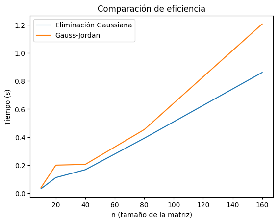

# [Taller 1b] Eliminación gaussiana vs Gauss-Jordan

- Richard Tipantiza
[Repositorio](https://github.com/keyaru18/Taller06_MetodosNum.git)

---
- Compare la complejidad computacional del método de eliminación gaussiana vs Gauss-Jordan. 
---

```python
%load_ext autoreload
```
## ELIMINACIÓN GAUSSIANA

```python
%autoreload 2
from src import eliminacion_gaussiana

Ab = [[4, 1, 2, 9], [2, 4, -1, -5], [1, 1,-3,-9.]]

eliminacion_gaussiana(Ab)
```
## GAUSS JORDAN

```python
%autoreload 2
from src import gauss_jordan

Ab = [[4, 1, 2, 9], [2, 4, -1, -5], [1, 1,-3,-9.]]

gauss_jordan(Ab)
```

## GRÁFICA

````python
import time
import numpy as np

import matplotlib.pyplot as plt

# Generar matrices de diferentes tamaños
sizes = [10, 20, 40, 80, 160]
gauss_times = []
jordan_times = []

for n in sizes:
    # Crear una matriz aumentada aleatoria de tamaño n x (n+1)
    A = np.random.rand(n, n)
    b = np.random.rand(n, 1)
    Ab_n = np.hstack([A, b]).tolist()
    
    # Medir tiempo para eliminacion_gaussiana
    start = time.time()
    eliminacion_gaussiana(Ab_n)
    gauss_times.append(time.time() - start)
    
    # Medir tiempo para gauss_jordan
    start = time.time()
    gauss_jordan(Ab_n)
    jordan_times.append(time.time() - start)

plt.plot(sizes, gauss_times, label='Eliminación Gaussiana')
plt.plot(sizes, jordan_times, label='Gauss-Jordan')
plt.xlabel('n (tamaño de la matriz)')
plt.ylabel('Tiempo (s)')
plt.title('Comparación de eficiencia')
plt.legend()
plt.show()
`````


